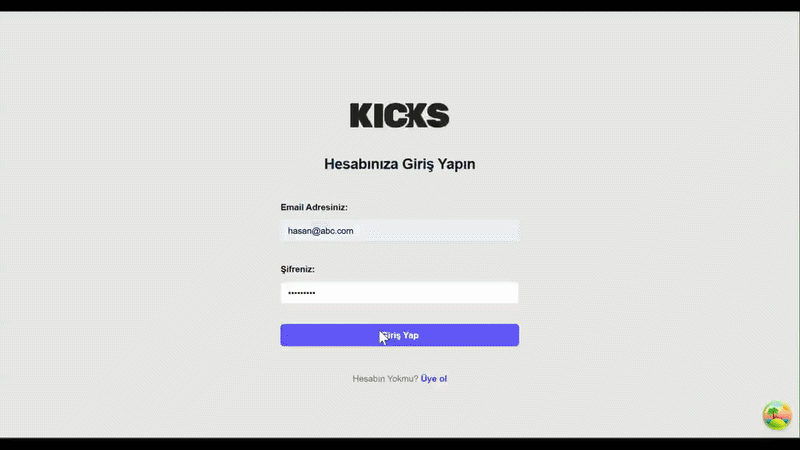

# 👟 Kicks - Full Stack Shoe Store
Bu proje, React (Frontend) ve Node.js/Express (Backend) kullanılarak geliştirilmiş, MongoDB Atlas veritabanı ile tam entegre çalışan bir ayakkabı mağazası uygulamasıdır.



🚀 Özellikler
- Kullanıcı Sistemi: JWT (JSON Web Token) tabanlı Register ve Login işlemleri.

- Dinamik Ürün Listesi: MongoDB'den çekilen, indirimli ve yeni ürün etiketlerine sahip ayakkabı modelleri.

- Veritabanı Yönetimi: MongoDB Atlas entegrasyonu ve Mongoose ODM kullanımı.

- Seed Sistemi: Tek bir komutla tüm ürün verilerini veritabanına otomatik yükleme.

- Responsive Tasarım: Modern ve şık kullanıcı arayüzü.

🛠 Kullanılan Teknolojiler
. Frontend: Vite, React, React Router, Redux Toolkit, Tailwind CSS.

. Backend: Node.js, Express, Mongoose, JWT, Dotenv.

. Veritabanı: MongoDB Atlas.

````bash
📦 Kurulum
Projeyi yerelinizde çalıştırmak için şu adımları izleyin:

1. Depoyu Klonlayın
Bash
git clone https://github.com/HasanEROL1/ShoeStore.git
cd ShoeStore
2. Backend Kurulumu
Bash
cd api
npm install
.env dosyasını oluşturun ve MONGO_URI değişkenini ekleyin.

3. Veritabanını Başlatma (Seed)
Ürünleri veritabanına yüklemek için:

Bash
npm run seed
4. Uygulamayı Çalıştırma
Backend (api klasöründe):

Bash
npm run dev
Frontend (ana klasörde):

Bash
npm run dev
````